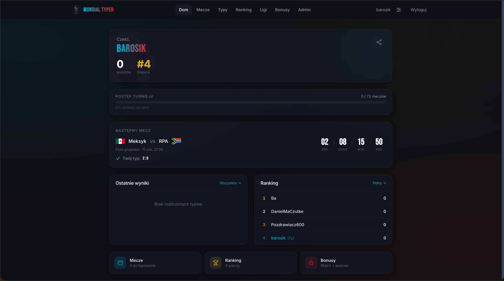
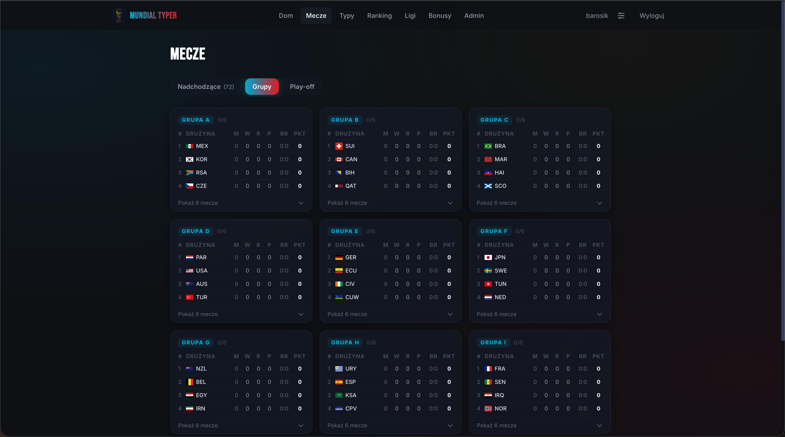
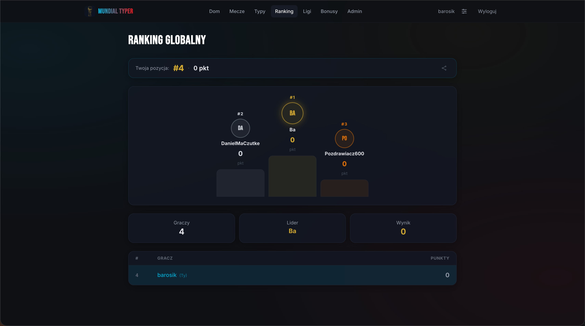
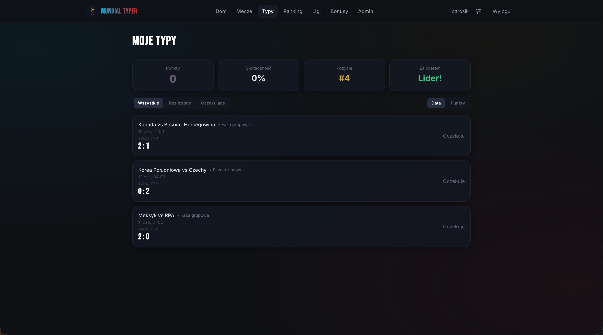
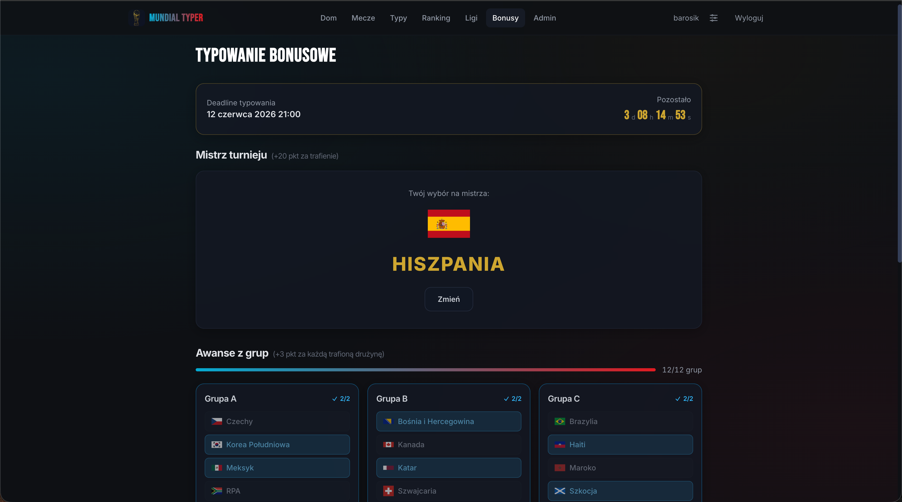
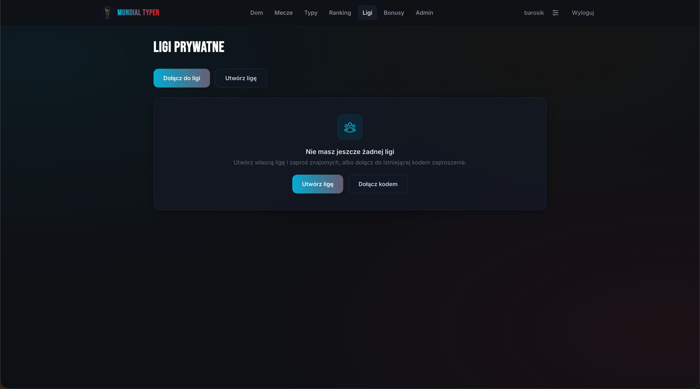

# Mundial Typer 2026

Aplikacja do typowania wyników meczów Mundialu 2026 dla znajomych. Prywatne ligi z kodem zaproszenia, automatyczne pobieranie wyników, ranking z podium i bonusy za mistrza turnieju.


> [English version below](#mundial-typer-2026-english)

---

## Screenshoty

| Dashboard | Mecze | Ranking |
|-----------|-------|---------|
|  |  |  |

| Moje Typy | Bonusy | Ligi prywatne |
|-----------|--------|---------------|
|  |  |  |

---

## Funkcje

- Typowanie wyników wszystkich 64 meczów Mundialu 2026
- Bonusy przed turniejem: mistrz i awanse z grup
- Ranking globalny z podium (złoto/srebro/brąz)
- Prywatne ligi — dołączanie kodem lub linkiem zaproszenia
- Dashboard z postępem turnieju, pozycją w lidze i passą
- Automatyczne pobieranie wyników z football-data.org co 5 minut
- PWA — instalacja na ekranie głównym telefonu
- Udostępnianie pozycji w rankingu (native share API)

---

## Punktacja

### Mecze — liczy się najwyższy trafiony próg

| Trafienie | Faza grupowa | 1/8 | Ćwierćfinał | Półfinał | Finał |
|-----------|:-----------:|:---:|:-----------:|:--------:|:-----:|
| Dokładny wynik | 5 | 7 | 9 | 11 | 15 |
| Różnica bramek | 3 | 4 | 5 | 6 | 8 |
| Wynik meczu (kto wygrał) | 2 | 3 | 4 | 5 | 6 |

### Bonusy

| Trafienie | Punkty | Kiedy przyznawane |
|-----------|--------|------------------|
| Mistrz turnieju | 20 | Po finale |
| Awans z grupy (za każdą drużynę) | 3 | Po fazie grupowej |

---

## Stack

| Warstwa | Technologia |
|---------|-------------|
| Frontend | React 18 + Vite (JavaScript) |
| Stylowanie | Tailwind CSS, glassmorphism |
| Backend | Python 3.12, FastAPI |
| Baza danych | PostgreSQL 16 (Neon) |
| Auth | JWT (httpOnly cookie) + Argon2id |
| Email | Resend |
| Dane meczów | football-data.org API |
| Hosting | Vercel + Render.com |

---

## Uruchomienie lokalnie

```bash
git clone <repo>
cd mundial_typer_2026

cp mundial-backend/.env.example mundial-backend/.env
# uzupełnij .env: JWT_SECRET, ADMIN_EMAILS

docker compose up --build
```

- Aplikacja: http://localhost:8080
- Swagger UI: http://localhost:8000/docs

Szczegóły dewelopki z hot-reload w `CLAUDE.md`.

---

## Deploy

**Vercel + Render + Neon — $0/mies.**

```
Frontend  → Vercel (darmowy)
Backend   → Render.com (darmowy, Web Service z obrazu Docker)
Baza      → Neon (darmowy, PostgreSQL 16)
Keep-alive → cron-job.org (ping /health co 10 min)
```

Obraz Dockera backendu budowany automatycznie przez GitHub Actions i publikowany na `ghcr.io`.

---

---

# Mundial Typer 2026 (English)

A World Cup 2026 prediction app for friends. Private leagues with invite codes, automatic results, leaderboard with podium and tournament bonuses.

**[▶ Open app](https://typer-mundial-2026-lyart.vercel.app)**

> [Wersja polska powyżej](#mundial-typer-2026)

---

## Screenshots

| Dashboard | Matches | Ranking |
|-----------|---------|---------|
|  |  |  |

| My Picks | Bonuses | Private Leagues |
|----------|---------|-----------------|
|  |  |  |

---

## Features

- Predict all 64 World Cup 2026 matches, change picks before kickoff
- Pre-tournament bonuses: champion pick and group stage advances
- Global leaderboard with gold/silver/bronze podium
- Private leagues — invite by code or shareable link
- Dashboard with tournament progress, league position and streak tracker
- Automatic result fetching from football-data.org every 5 minutes
- PWA — installable on mobile home screen
- Share your ranking position (native share API)

---

## Scoring

### Matches — highest matching tier wins

| Tier | Group | R16 | QF | SF | Final |
|------|:-----:|:---:|:--:|:--:|:-----:|
| Exact score | 5 | 7 | 9 | 11 | 15 |
| Goal difference | 3 | 4 | 5 | 6 | 8 |
| Correct winner | 2 | 3 | 4 | 5 | 6 |

### Bonuses

| Pick | Points | Awarded |
|------|--------|---------|
| Tournament champion | 20 | After final |
| Group advance (per team) | 3 | After group stage |

---

## Tech Stack

| Layer | Technology |
|-------|------------|
| Frontend | React 18 + Vite |
| Styling | Tailwind CSS |
| Backend | Python 3.12, FastAPI |
| Database | PostgreSQL 16 (Neon) |
| Auth | JWT (httpOnly cookie) + Argon2id |
| Email | Resend |
| Match data | football-data.org API |
| Hosting | Vercel + Render.com |

---

## Run Locally

```bash
git clone <repo>
cd mundial_typer_2026

cp mundial-backend/.env.example mundial-backend/.env
# set JWT_SECRET and ADMIN_EMAILS

docker compose up --build
# App: http://localhost:8080
# Swagger: http://localhost:8000/docs
```
